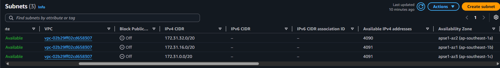
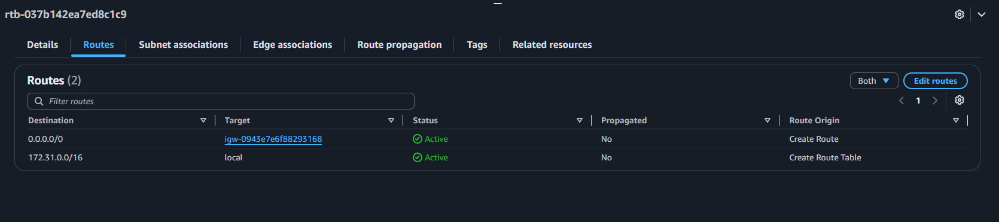
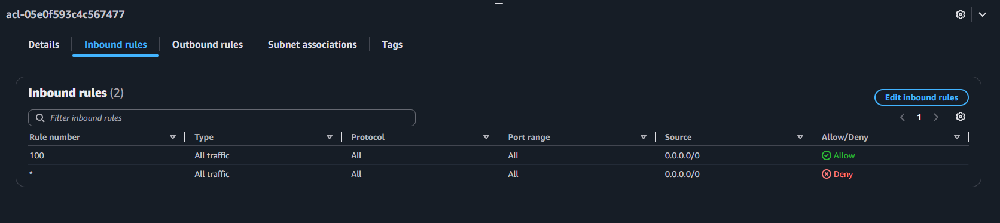
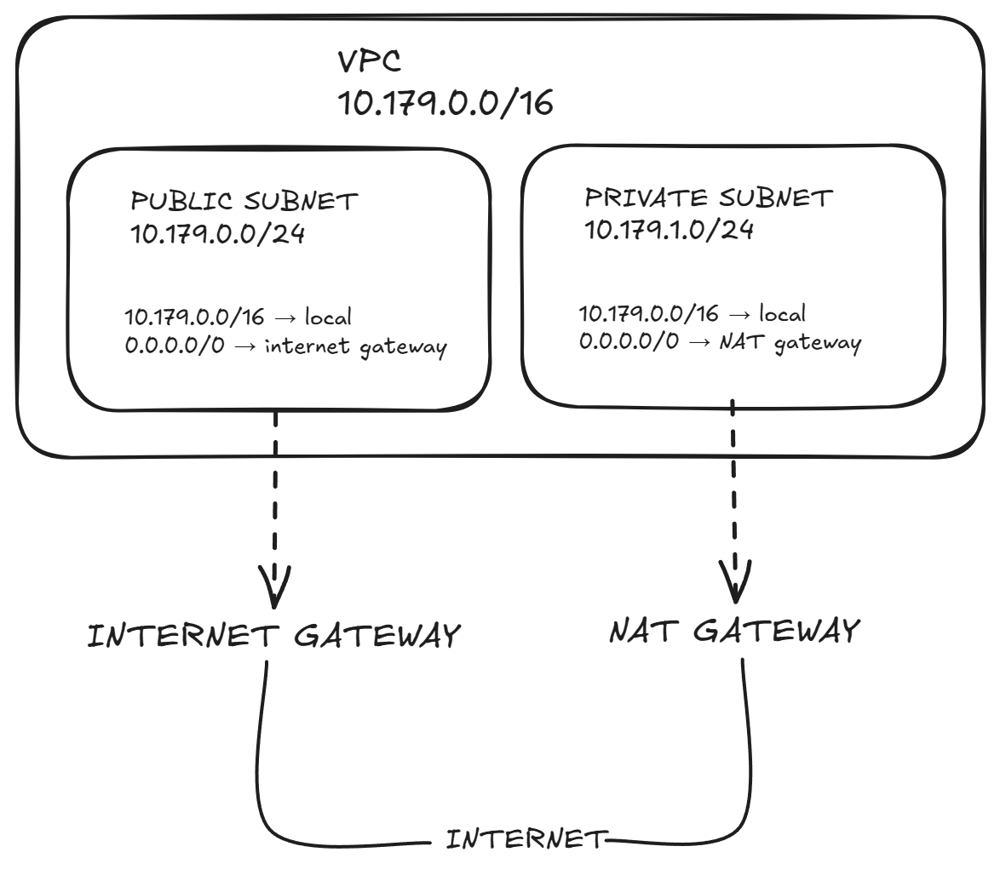

# Assignment 2 Submission

<!--
How to use this template:

1. Copy this file to submissions/assignment-2/<your-github-username>/submission.md
2. Replace every answer placeholder with your own answer. Delete the angle brackets too.
3. Save your four images in the same folder, with the exact file names below.
4. Do not write your full name or your student number in this file.
-->

## About me

- GitHub username: saromoAndreiLuis
- Section: 4CCSAD
- IAM user name that I signed in with: ccsad-g02
- X: 179

---

## Part A. Explore

### A1. The VPC

Default VPC IPv4 CIDR:

>**172.31.0.0/16**

Number of addresses in that CIDR:

>65,536

### A2. The subnets

| Availability Zone | IPv4 CIDR |
| --- | --- |
| apse1-az2 (ap-southeast-1a)| 172.31.32.0/20 |
| apse1-az1 (ap-southeast-1b)| 172.31.16.0/20 |
| apse1-az1 (ap-southeast-1c) | 172.31.0.0/20 |

Screenshot 1. Save it as `screenshot-1-subnets.png` in your folder. The image line below shows it.

### A3. Available addresses

Available IPv4 addresses in each subnet:

>4090
>4091
>4091

Why is the number lower than 4,096?

>**AWS keeps 5 addresses in every subnet**

What uses the missing address in the subnet with the lowest number?

>**An instance gets its address through a network interface. The network interface keeps its address while the instance is stopped. A stopped instance still uses one address in its subnet.**

### A4. The route table

| Destination | Target |
| --- | --- |
| 0.0.0.0/0 | igw-0943e7e6f88293168 |
| 172.31.0.0/16 | local |

Screenshot 2. Save it as `screenshot-2-routes.png` in your folder. The image line below shows it.

### A5. Public or private

Are the default subnets public or private? Which route proves it?

>The default subnet is public because its route table has a 0.0.0.0/0 route pointing to the Internet Gateway. This route allows resources with public IP addresses to communicate with the internet.

### A6. The internet gateway

State of the internet gateway:

>Attached

What happens to the default subnets if the gateway is detached?

>When a gateway is detached, the default subnets remain intact and configurations are preserved, but their external routes enter a "blackhole" status, completely cutting off their internet connectivity while maintaining internal VPC communication.
>An attached internet gateway does not open anything by itself. A subnet uses the gateway only when the route table of the subnet sends traffic to it. Section 8 explains route tables

### A7. NAT gateways

Number of NAT gateways:

>**0**

Can a server in a new private subnet download updates? Why?

>No, a server in a new private subnet cannot download updates by default because a private subnet lacks a route to an internet-facing gateway required to pull files from public repositories.s
>To allow the server to download updates safely, you must deploy a NAT Gateway in a public subnet and add a route (0.0.0.0/0) in your private subnet's route table pointing to that NAT Gateway.

### A8. The network ACL

| Rule number | Source | Allow or Deny |
| --- | --- | --- |
| 100 | 0.0.0.0/0 | **✅Allow** |
| * | 0.0.0.0/0 | **❌Deny** |

How is a network ACL different from a security group?

<answer>

Screenshot 3. Save it as `screenshot-3-network-acl.png` in your folder. The image line below shows it.

### A9. The default security group

Inbound rule (type and source):

	
All traffic

Which resources can send traffic to an instance that uses it?

>Resources associated with the same default security group can send inbound traffic to the instance. The default security group does not normally allow inbound traffic from the entire internet unless an additional inbound rule is added.

---

## Part B. Prepare

### B1. Plan two subnets

> **MY VPC CIDR: 10.179.0.0/16**

- Public subnet CIDR: 10.179.0.0/24
- Private subnet CIDR: 10.179.1.0/24

### B2. Route tables

Route table of the public subnet:

| Destination | Target |
| --- | --- |
| 10.179.0.0/16 | local |
| 0.0.0.0/0 | internet gateway |

Route table of the private subnet:

| Destination | Target |
| --- | --- |
| 10.179.0.0/16 | local |
| 0.0.0.0/0 | NAT gateway |

### B3. My VPC diagram

Tool used (Excalidraw, draw.io, Lucidchart, or paper):

<answer>

Save your diagram as `vpc-diagram.png` in your folder. The image line below shows it.

### B4. Predict a change

Can you still open the web page from your laptop? Why?

>No, I cannot open the instance web page from my laptop because the 0.0.0.0/0 route was removed, so there is no route for internet traffic through the Internet Gateway.

Can the instance still reach another instance in the VPC? Why?

>Yes, the instance can still reach another instance in the same VPC because the local route for 10.179.0.0/16 still allows communication within the VPC.

### B5. Place a database

Which subnet gets the database? Why?

>I would put the database server in the private subnet because databases should not be directly accessible from the public internet. The private subnet provides better security while still allowing resources inside the VPC to communicate with the database.

### B6. My question about VPCs

What is your question, and what made you think of it?

>This activity showed me that different subnets can have different route tables, so I wondered how routing would work if a VPC had many subnets for different types of servers.
